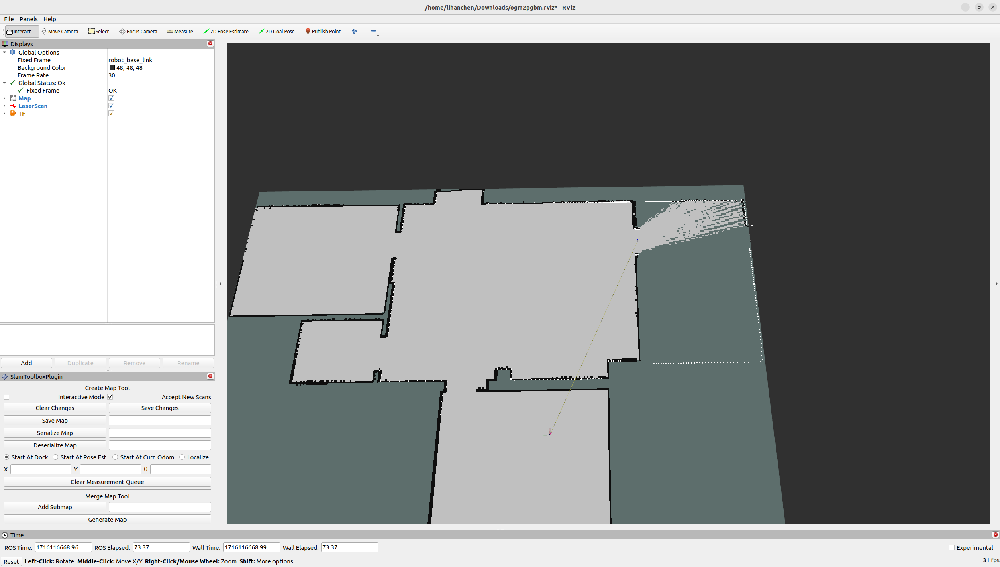

[](https://zenodo.org/badge/latestdoi/513174972)

# OGM2PGBM: Occupancy Grid Map to Pose Graph-based Map for long-term 2D LiDAR-based localization

This repo contains the following two applications:

1. `OGM2PGBM`: generate pose graph-based maps on 2D occupancy grid maps, which can be created from a TLS Point cloud or a BIM/CAD model.
This pose graph-based maps can be used for accurate localization in changing and dynamic environments, as demostrated in our [paper][paper].

    The following animation shows an overview of the method and compares AMCL and Cartographer; the latter can be applied after leveraging the Ogm2Pgbm package.
    It is clear that for AMCL is more difficult to keep track of the pose of the robot in comparison with the performance of Cartographer.

    

2. `GMCL & CARTO/SLAM_toolbox`: conbine the fast global localization feature of GMCL with the more accurate pose tracking performance of Cartographer/SLAM_toolbox

Additionally, it includes  the packages `amcl`, `gmcl`, `cartographer` and `slam_toolbox`, so that they can be used and compared with a bagfile that should be located in the mounted directory `~/workspace` easily.

## Table of Contents

- [Requirements](#requirements)
- [OGM2PGBM](#ogm2pgbm)
  - [Principle](#principle)
  - [Running the code](#running-the-code)
    - [I. Refine and Edit the PGM Map](#i-refine-and-edit-the-pgm-map)
    - [II. Use Ogm2Pgbm to Obtain a Rosbag with PointCloud and Poses](#ii-use-ogm2pgbm-to-obtain-a-rosbag-with-pointcloud-and-poses)
      - [2.1 Use Docker to Obtain the Package](#21-use-docker-to-obtain-the-package)
      - [2.2 Start the Package](#22-start-the-package)
    - [III. For ROS1 users](#iii-for-ros1-users)
    - [IV. For ROS2 users](#iv-for-ros2-users)
      - [4.1 Download the Rosbag to the Host Machine](#41-download-the-rosbag-to-the-host-machine)
      - [4.2 Convert .bag to .db3](#42-convert-bag-to-db3)
      - [4.3 Play the Rosbag and Generate the Map](#43-play-the-rosbag-and-generate-the-map)
      - [4.4 Save the .posegraph Map](#44-save-the-posegraph-map)
- [GMCL & CARTO/SLAM_toolbox](#gmcl--cartoslam_toolbox)
- [Citation](#citation)
- [Reference projects](#reference-projects)

## Requirements

If you plan to use our docker container, with all the methods installed (**Warning:** it requires >5 GB of space) you only need to
install [docker][docker].

If you **don't want to use docker** and only want to use the Ogm2Pgbm package, you can install the content of [this folder](https://github.com/MigVega/Ogm2Pgbm/tree/main/ogm2pgbm) and use it as a normal catkin package.

If you still want to install all the different localization methods, you can have a look at the [docker file][docker_file] and install the respective dependencies on your local machine.

## OGM2PGBM

### Principle

The workflow of OGM2PGBM is as follows, see the function `new_map_callback(self,  grid_map)` for details:

1. **Subscribe** map from the map topic
2. **Skeletonize** the map and get its voronoi waypoint (see `self.skeletonize()`)
3. Perform a **coverage path planning** on it (see `self.CPP()`)
   - Extract the farest endpoint pair first as the start and goal point
   - Then **dilate** it with a 2x2 kernel to bold the centerline
   - Do CPP wavefront algorithm and get the sorted waypoint
4. Do a raytracing on the waypoints one by one, and publish the `/laserscan` topic (see `self.raytracer()`)

It produces `/tf`, `/clock`, `/odom`,  `/scan` topics with frame `robot_map`, `robot_odom` and `robot_base_link`.

Since `/tf` is needed, `python2.7` is used in this script.

### Running the code

This package already provides a Dockerfile, which means you can run it on any Ubuntu version. However, for ROS2 users, the final step of generating .pbstream or .posegraph is different. I will explain this in detail below.

This might also be a way to edit the posegraph map, but it's a bit convoluted.

#### I. Refine and Edit the PGM Map

Modify the map as needed by adding or removing barriers. The most crucial step is to **completely black out the obstacles, ensuring there are no white areas within any obstacles!**

|Before|After|
|:-:|:-:|
|||

#### II. Use Ogm2Pgbm to Obtain a Rosbag with PointCloud and Poses

##### 2.1 Use Docker to Obtain the Package

1. First clone the repository

    ```Shell
    git clone https://github.com/MigVega/Ogm2Pgbm.git
    cd Ogm2Pgbm
    ```

2. Pull the Docker image

    [LihanChen](https://github.com/LihanChen2004) has build a [Docker image](https://hub.docker.com/repository/docker/lihanchen2004/ogm2pgbm/) for easy deployment. You can also choose to build your own Docker image.

    ```Shell
    docker pull lihanchen2004/ogm2pgbm:latest
    ```

3. Create the container based on docker image

    If you are using a self-built image, please modify the `image_name` at the beginning of [autorun.sh](./autorun.sh).

    ```Shell
    ./autorun.sh
    ```

##### 2.2 Start the Package

Copy the `.pgm` and `.yaml` files you need to convert to the `Ogm2Pgbm/workspace/map/` directory on the host machine.

All following operations should be performed inside the Docker container.  
**Ensure the current terminal is within the Docker container.**

```Shell
MAP_NAME=OGM_empty

roslaunch ogm2pgbm ogm2pgbm.launch map_file:=/root/workspace/map/$MAP_NAME.yaml record:=true
```

Wait for 2-3 minutes. After completion, the program will output "Done" in the terminal.

Terminate the program with Ctrl+C. The rosbag will automatically be saved to `/root/.ros/ogm2pgbm_sensordata.bag`.

#### III. For ROS1 users

> If you want to use posegraph or pbstream file directly in ROS1, please follow the tutorial in this section.

After generating bagfiles, use Cartographer to generate pbstream or SLAM toolbox to generate posegraph maps. With the following command **Cartographer** will run in offline mode, which will generate pbstream quite fast, but without any visual output in rviz.

```Shell
roslaunch cartographer_ros ogm2pgbm_my_robot.launch bag_filename:=/root/.ros/ogm2pgbm_sensordata.bag
```


You can also launch **Slam_toolbox**. (There will be some error report in the terminal, just ignore them and wait for some seconds.)

```Shell
roslaunch slam_toolbox ogm2pgbm.launch bag_filename:=/root/.ros/ogm2pgbm_sensordata.bag
```


The target pbstream file will be generated automatically at `/root/.ros/ogm2pgbm_sensordata.bag.pbstream` after . For slam_toolbox, you also need to click on the serialization button on the rviz plugin. The target files are also located at `/root/.ros`.

#### IV. For ROS2 users

> If you want to use posegraph or pbstream file in ROS2, please follow the tutorial in this section.

All following operations should be performed on the **host machine**.

##### 4.1 Download the Rosbag to the Host Machine

1. Get the `CONTAINER ID` of ogm2pgbm:

    ```Shell
    docker ps
    ```

2. Save the rosbag to the host machine:

    **Remember to modify `CONTAINER_ID`!** Here, I save the rosbag from the container to the host's Download directory:

    ```Shell
    CONTAINER_ID=xxx
    CONTAINER_PATH=/root/.ros/ogm2pgbm_sensordata.bag
    DST_PATH=~/Downloads/

    docker cp $CONTAINER_ID:$CONTAINER_PATH $DST_PATH
    ```

##### 4.2 Convert .bag to .db3

In ROS1, rosbag files have a .bag suffix, which is a binary format for storing ROS messages. ROS2 has improved and extended the rosbag format, adopting an SQLite-based database format that includes a .db3 database and a .yaml file.

1. Install the [rosbags conversion](https://gitlab.com/ternaris/rosbags) package:

    ```Shell
    pip install rosbags
    ```

2. Navigate to the directory containing the rosbag and execute the following command to convert `ogm2pgbm_sensordata.bag` to `ogm2pgbm_sensordata.db3`:

    ```Shell
    rosbags-convert --src ogm2pgbm_sensordata.bag \
    --dst ogm2pgbm_sensordata \
    --src-typestore empty \
    --dst-typestore ros2_humble \
    --exclude-topic /rosout /robot/map /rosout_agg
    ```

##### 4.3 Play the Rosbag and Generate the Map

1. Preparation

    You can use the following rviz configuration file for visualization.

    <details>
    <summary>ogm2pgbm.rviz (Click to expand)</summary>

    ```yaml
    Panels:
    - Class: rviz_common/Displays
        Help Height: 78
        Name: Displays
        Property Tree Widget:
        Expanded:
            - /Global Options1
            - /Status1
        Splitter Ratio: 0.5
        Tree Height: 684
    - Class: rviz_common/Selection
        Name: Selection
    - Class: rviz_common/Tool Properties
        Expanded:
        - /2D Goal Pose1
        - /Publish Point1
        Name: Tool Properties
        Splitter Ratio: 0.5886790156364441
    - Class: rviz_common/Views
        Expanded:
        - /Current View1
        Name: Views
        Splitter Ratio: 0.5
    - Class: rviz_common/Time
        Experimental: false
        Name: Time
        SyncMode: 0
        SyncSource: LaserScan
    - Class: slam_toolbox::SlamToolboxPlugin
        Name: SlamToolboxPlugin
    Visualization Manager:
    Class: ""
    Displays:
        - Alpha: 0.699999988079071
        Class: rviz_default_plugins/Map
        Color Scheme: map
        Draw Behind: false
        Enabled: true
        Name: Map
        Topic:
            Depth: 5
            Durability Policy: Volatile
            Filter size: 10
            History Policy: Keep Last
            Reliability Policy: Reliable
            Value: /map
        Update Topic:
            Depth: 5
            Durability Policy: Volatile
            History Policy: Keep Last
            Reliability Policy: Reliable
            Value: /map_updates
        Use Timestamp: false
        Value: true
        - Alpha: 1
        Autocompute Intensity Bounds: true
        Autocompute Value Bounds:
            Max Value: 10
            Min Value: -10
            Value: true
        Axis: Z
        Channel Name: intensity
        Class: rviz_default_plugins/LaserScan
        Color: 255; 255; 255
        Color Transformer: Intensity
        Decay Time: 0
        Enabled: true
        Invert Rainbow: false
        Max Color: 255; 255; 255
        Max Intensity: 4096
        Min Color: 0; 0; 0
        Min Intensity: 0
        Name: LaserScan
        Position Transformer: XYZ
        Selectable: true
        Size (Pixels): 3
        Size (m): 0.009999999776482582
        Style: Points
        Topic:
            Depth: 5
            Durability Policy: Volatile
            Filter size: 10
            History Policy: Keep Last
            Reliability Policy: Reliable
            Value: /scan
        Use Fixed Frame: true
        Use rainbow: true
        Value: true
        - Class: rviz_default_plugins/TF
        Enabled: true
        Frame Timeout: 15
        Frames:
            All Enabled: true
            base_link:
            Value: true
            lidar_odom:
            Value: true
            livox_frame:
            Value: true
            odom:
            Value: true
            robot_base_link:
            Value: true
            robot_map:
            Value: true
            robot_odom:
            Value: true
            wheel_1:
            Value: true
            wheel_2:
            Value: true
            wheel_3:
            Value: true
            wheel_4:
            Value: true
        Marker Scale: 1
        Name: TF
        Show Arrows: true
        Show Axes: true
        Show Names: false
        Tree:
            robot_map:
            robot_base_link:
                {}
            robot_odom:
                {}
        Update Interval: 0
        Value: true
    Enabled: true
    Global Options:
        Background Color: 48; 48; 48
        Fixed Frame: robot_base_link
        Frame Rate: 30
    Name: root
    Tools:
        - Class: rviz_default_plugins/Interact
        Hide Inactive Objects: true
        - Class: rviz_default_plugins/MoveCamera
        - Class: rviz_default_plugins/Select
        - Class: rviz_default_plugins/FocusCamera
        - Class: rviz_default_plugins/Measure
        Line color: 128; 128; 0
        - Class: rviz_default_plugins/SetInitialPose
        Covariance x: 0.25
        Covariance y: 0.25
        Covariance yaw: 0.06853891909122467
        Topic:
            Depth: 5
            Durability Policy: Volatile
            History Policy: Keep Last
            Reliability Policy: Reliable
            Value: /initialpose
        - Class: rviz_default_plugins/SetGoal
        Topic:
            Depth: 5
            Durability Policy: Volatile
            History Policy: Keep Last
            Reliability Policy: Reliable
            Value: /goal_pose
        - Class: rviz_default_plugins/PublishPoint
        Single click: true
        Topic:
            Depth: 5
            Durability Policy: Volatile
            History Policy: Keep Last
            Reliability Policy: Reliable
            Value: /clicked_point
    Transformation:
        Current:
        Class: rviz_default_plugins/TF
    Value: true
    Views:
        Current:
        Class: rviz_default_plugins/Orbit
        Distance: 25.282127380371094
        Enable Stereo Rendering:
            Stereo Eye Separation: 0.05999999865889549
            Stereo Focal Distance: 1
            Swap Stereo Eyes: false
            Value: false
        Focal Point:
            X: -1.1839663982391357
            Y: 1.0030579566955566
            Z: -0.871300458908081
        Focal Shape Fixed Size: true
        Focal Shape Size: 0.05000000074505806
        Invert Z Axis: false
        Name: Current View
        Near Clip Distance: 0.009999999776482582
        Pitch: 1.1747967004776
        Target Frame: <Fixed Frame>
        Value: Orbit (rviz)
        Yaw: 3.125408411026001
        Saved: ~
    Window Geometry:
    Displays:
        collapsed: false
    Height: 1376
    Hide Left Dock: false
    Hide Right Dock: false
    QMainWindow State: 000000ff00000000fd000000040000000000000217000004c2fc0200000009fb0000001200530065006c0065006300740069006f006e00000001e10000009b0000005c00fffffffb0000001e0054006f006f006c002000500072006f00700065007200740069006500730200000438000001df00000185000000a3fb000000120056006900650077007300200054006f006f02000001df000002110000018500000122fb000000200054006f006f006c002000500072006f0070006500720074006900650073003203000002880000011d000002210000017afb000000100044006900730070006c006100790073010000003d00000337000000c900fffffffb0000002000730065006c0065006300740069006f006e00200062007500660066006500720200000138000000aa0000023a00000294fb00000014005700690064006500530074006500720065006f02000000e6000000d2000003ee0000030bfb0000000c004b0069006e0065006300740200000186000001060000030c00000261fb000000220053006c0061006d0054006f006f006c0062006f00780050006c007500670069006e010000037a000001850000018500ffffff000000010000010f000002b0fc0200000003fb0000001e0054006f006f006c002000500072006f00700065007200740069006500730100000041000000780000000000000000fb0000000a00560069006500770073000000003d000002b0000000a400fffffffb0000001200530065006c0065006300740069006f006e010000025a000000b200000000000000000000000200000490000000a9fc0100000001fb0000000a00560069006500770073030000004e00000080000002e10000019700000003000009ba0000003efc0100000002fb0000000800540069006d00650100000000000009ba000002fb00fffffffb0000000800540069006d006501000000000000045000000000000000000000079d000004c200000004000000040000000800000008fc0000000100000002000000010000000a0054006f006f006c00730100000000ffffffff0000000000000000
    Selection:
        collapsed: false
    SlamToolboxPlugin:
        collapsed: false
    Time:
        collapsed: false
    Tool Properties:
        collapsed: false
    Views:
        collapsed: false
    Width: 2490
    X: 70
    Y: 27
    ```

    </details>

2. In the 1st Shell: Start the slam_toolbox to prepare for mapping

    ```Shell
    ros2 run slam_toolbox async_slam_toolbox_node --ros-args \
    -p use_sim_time:=True \
    -p odom_frame:=robot_odom \
    -p base_frame:=robot_base_link \
    -p map_frame:=robot_map \
    -p do_loop_closing:=False \
    -p max_laser_range:=10.0
    ```

3. In the 2nd Shell: Play the rosbag

    ```Shell
    ros2 bag play ogm2pgbm_sensordata
    ```

4. In the 3rd Shell: Start rviz2 for visualization

    Ensure to modify the rviz2 configuration file path

    ```Shell
    rviz2 -d ~/Downloads/ogm2pgbm.rviz 
    ```



##### 4.4 Save the .posegraph Map

After the rosbag finishes playing, set the filename in the `SlamToolBoxPlugin` on the left side of the rviz2 interface, and click `Serialize Map` button to save the posegraph map.

---

#### Note

1. The reason for not using [Ogm2Pgbm](https://github.com/MigVega/Ogm2Pgbm) to directly generate the .posegraph map is due to a previously encountered issue where maps generated in ROS1 could not be loaded in ROS2. This is likely due to a version issue with slam_toolbox.

    ```Shell
    [localization_slam_toolbox_node-12] [ERROR] [1715064875.276643345] [slam_toolbox]: serialization::Read: Failed to read file: Exception: unregistered class
    [localization_slam_toolbox_node-12] [ERROR] [1715064875.276682895] [slam_toolbox]: DeserializePoseGraph: Failed to read file: /home/lihanchen/NAVIGATION_WS/RM2024_SMBU_auto_sentry_ws/install/rm_bringup/share/rm_bringup/map/RMUC.
    ```

2. As it is already a package managed by catkin, if you have changed the src code or configuation inside the container, you need to do the following instructions to compile and install the package and source the env.

    ```Shell
    catkin_make_isolated --install --use-ninja --pkg ogm2pgbm
    source install_isolated/setup.bash
    ```

3. All the node will be closed when the rviz is closed, including the rosbag node

4. The parameters of cartographer when using OGM2PGBM scripts to generate pbstream are as follows (see `cartographer_ros/configuration_files/ogm2pgbm_my_robot.lua`)

5. remap `/scan` or `/odom` in launch file if needed

## GMCL & CARTO/SLAM_toolbox

This project combines the pros of the two algorithms, using the fast global localization feature of GMCL and the accurate pose tracking performance of Cartographer or SLAM toolbox.

- First, change the bagname in the line 11 of the file `~/catkin_ws/src/gmcl_carto/gmcl_carto.py`.
- Then, make sure the bagfile is located in the directory `/root/workspace`.
- At last, run the script directly `python ~/catkin_ws/src/gmcl_carto/gmcl_carto.py`.
- Do the same if you want to run `gmcl_carto/gmcl_slamtoolbox.py` instead.

## Citation

If you use this library for an academic work, please cite the original [paper][paper].

```bibtex
@inproceedings{ vega:2022:2DLidarLocalization,
    author = {Vega Torres, M.A. and Braun, A. and Borrmann, A.},
    title = {Occupancy Grid Map to Pose Graph-based Map: Robust BIM-based 2D- LiDAR Localization for Lifelong Indoor Navigation in Changing and Dynamic Environments},
    booktitle = {eWork and eBusiness in Architecture, Engineering and Construction: ECPPM 2022},
    editor = {Eilif Hjelseth, Sujesh F. Sujan, and Raimar Scherer},
    publisher = {CRC Press},
    year = {2022},
    month = {Sep},
    url = {https://publications.cms.bgu.tum.de/2022_ECPPM_Vega.pdf},
    isbn = {978-1-003-35422-2},
    doi = {10.1201/9781003354222-72}
}
```

Please also cite the code, if you use it for your experiments:
[](https://zenodo.org/badge/latestdoi/513174972)

```bibtex
@software{miguel_vega_2022_7330270,
  author       = {Vega Torres, M.A.},
  title        = {{Occupancy Grid Map to Pose Graph-based Map for
                   long-term 2D LiDAR-based localization}},
  month        = nov,
  year         = 2022,
  publisher    = {Zenodo},
  version      = {1.0},
  doi          = {10.5281/zenodo.7330270},
  url          = {https://doi.org/10.5281/zenodo.7330270}
}
```

## Reference projects

- [AMCL](http://wiki.ros.org/amcl)
- [GMCL](http://wiki.ros.org/gmcl)
- [Cartographer](https://github.com/cartographer-project/cartographer)
- [SLAM_Toolbox](https://github.com/SteveMacenski/slam_toolbox)

<!-- References -->
[paper]: https://publications.cms.bgu.tum.de/2022_ECPPM_Vega.pdf
[docker]: https://docs.docker.com/get-docker/
[docker_file]: https://github.com/MigVega/Ogm2Pgbm/blob/main/Dockerfile
