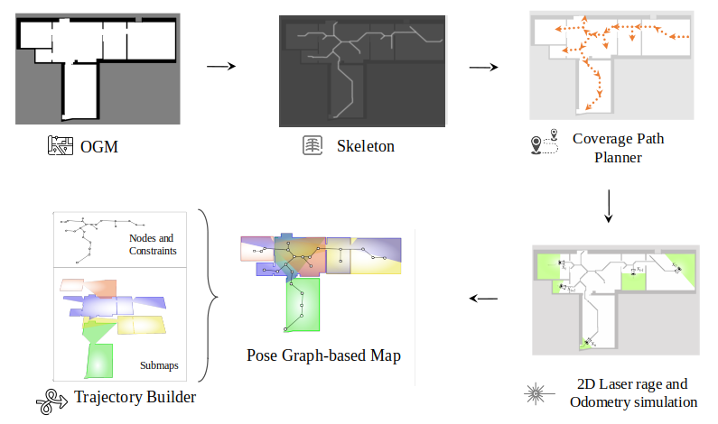

 [](https://zenodo.org/badge/latestdoi/513174972)
# OGM2PGBM: Occupancy Grid Map to Pose Graph-based Map for long-term 2D LiDAR-based localization

This repo contains the following two applications:

1. `OGM2PGBM`: generate pose graph-based maps on 2D occupancy grid maps, which can be created from a TLS Point cloud or a BIM/CAD model.
This pose graph-based maps can be used for accurate localization in changing and dynamic environments, as demostrated in our [paper][paper].

The following figure shows an overview of the proposed open source method.
<p align="center">
  
</p>

2. `GMCL & CARTO/SLAM_toolbox`: conbine the fast global localization feature of GMCL with the more accurate pose tracking performance of Cartographer/SLAM_toolbox

Additionally, it includes  the packages `amcl`, `gmcl`, `cartographer` and `slam_toolbox`, so that they can be used and compared with a bagfile that should be located in the mounted directory `~/workspace` easily. 


## Table of Contents
==================================
- [Requirements](#requirements)
* [OGM2PGBM](#ogm2pgbm)
   * [Principle](#principle)
   * [Running the code](#running-the-code)
      * [Args](#args)
      * [Step by step](#step-by-step)
      * [Note](#note)
* [GMCL & CARTO/SLAM_toolbox](#gmcl--cartoslam_toolbox)
* [Citation](#citation)
* [Reference projects](#reference-projects)


## Requirements

If you plan to use our docker container, with all the methods installed (Warning: it requires >5 GB of space) you only need to
install [docker][docker].

If you **don't want to use docker** and only want to use the Ogm2Pgbm package, you can install the content of [this folder](https://github.com/MigVega/Ogm2Pgbm/tree/main/ogm2pgbm) and use it as a normal catkin package.

If you still want to insall all the different localization methods, you can have a look at the [docker file][docker_file] and install the respective dependencies on your local machine.

## OGM2PGBM

### Principle

The workflow of OGM2PGBM is as follows, see the function `new_map_callback(self,  grid_map)` for details:

1. **Subscribe** map from the map topic
2. **Skeletonize** the map and get its voronoi waypoint (see `self.skeletonize()`)
3. Perform a **coverage path planning** on it (see `self.CPP()`)
   - Extract the farest endpoint pair first as the start and goal point
   - Then **dilate** it with a 2x2 kernel to bold the centerline
   - Do CPP wavefront algorithm and get the sorted waypoint
4. Do a raytracing on the waypoints one by one, and publish the `/laserscan` topic (see `self.raytracer()`)

It produces `/tf`, `/clock`, `/odom`,  `/scan` topics with frame `robot_map`, `robot_odom` and `robot_base_link`.

Since `/tf` is needed, `python2.7` is used in this script. 

### Running the code

#### Args
This package is a standard ros package and can be launched with roslaunch command.

args:
- `map_file`: default value is `/root/workspace/map/OGM_empty.pgm.yaml`
- `record`: default value is `false`, the recorded bag can be found at `/root/.ros/ogm2pgbm_sensordata.bag`

#### Step by step
0. First clone the repository.

```shell
git clone https://github.com/MigVega/Ogm2Pgbm.git
cd Ogm2Pgbm
```
With the launch file, we only need three steps to generate the base pbstream/posegraph based-map.
1. run into the docker 
```shell
bash autorun.sh
```
Note: If you get the error `docker: Error response from daemon: could not select device driver "" with capabilities: [[gpu]].`
install `nvidia-container-toolkit` with the following command `sudo apt-get update && sudo apt-get install -y nvidia-container-toolkit`

2. launch the application with or without the args
```shell
roslaunch ogm2pgbm ogm2pgbm.launch map_file:=/root/workspace/map/OGM_empty.pgm.yaml record:=true 
```
The target bag file will be stored under `/root/.ros/ogm2pgbm_sensordata.bag`. By default, the demo bag will also be copied into this place. So you can also skip the second step if you want.

3. After generating bagfiles, use Cartographer to generate pbstream or SLAM toolbox to generate posegraph maps.
With the following command **Cartographer** will run in offline mode, which will generate pbstream quite fast, but without any visual output in rviz.

```
roslaunch cartographer_ros ogm2pgbm_my_robot.launch bag_filename:=/root/.ros/ogm2pgbm_sensordata.bag
```
You can also launch **Slam_toolbox**. (There will be some error report in the terminal, just ignore them and wait for some seconds.)
```shell
roslaunch slam_toolbox ogm2pgbm.launch bag_filename:=/root/.ros/ogm2pgbm_sensordata.bag
```
<p align="center">
  
</p>

The target pbstream file will be generated automatically at `/root/.ros/ogm2pgbm_sensordata.bag.pbstream` after . 
For slam_toolbox, you also need to click on the serialization button on the rviz plugin. The target files are also located at `/root/.ros`.

#### Note
1. As it is already a package managed by catkin, if you have changed the src code or configuation inside the container, you need to do the following instructions to compile and install the package and source the env.
  ```shell
  catkin_make_isolated --install --use-ninja --pkg ogm2pgbm
  source install_isolated/setup.bash
  ```
2. All the node will be closed when the rviz is closed, including the rosbag node
3. The parameters of cartographer when using OGM2PGBM scripts to generate pbstream are as follows (see `cartographer_ros/configuration_files/ogm2pgbm_my_robot.lua`)
- remap `/scan` or `/odom` in launch file if needed


## GMCL & CARTO/SLAM_toolbox
This project combines the pros of the two algorithms, using the fast global localization feature of GMCL and the accurate pose tracking performance of Cartographer or SLAM toolbox.

- First, change the bagname in the line 11 of the file `~/catkin_ws/src/gmcl_carto/gmcl_carto.py`.
- Then, make sure the bagfile is located in the directory `/root/workspace`.
- At last, run the script directly `python ~/catkin_ws/src/gmcl_carto/gmcl_carto.py`. 
- Do the same if you want to run `gmcl_carto/gmcl_slamtoolbox.py` instead.

## Citation
If you use this library for an academic work, please cite the original [paper][paper].

```bibtex
@inproceedings{ vega:2022:2DLidarLocalization,
	author = {Vega Torres, M.A. and Braun, A. and Borrmann, A.},
	title = {Occupancy Grid Map to Pose Graph-based Map: Robust BIM-based 2D- LiDAR Localization for Lifelong Indoor Navigation in Changing and Dynamic Environments},
	booktitle = {eWork and eBusiness in Architecture, Engineering and Construction: ECPPM 2022},
	editor = {Eilif Hjelseth, Sujesh F. Sujan, and Raimar Scherer},
	publisher = {CRC Press},
	year = {2022},
	month = {Sep},
	url = {https://publications.cms.bgu.tum.de/2022_ECPPM_Vega.pdf},
	isbn = {978-1-003-35422-2}
}
```
Please also cite the code:
<a href="https://zenodo.org/badge/latestdoi/513174972"></a>
   
## Reference projects
- [AMCL](http://wiki.ros.org/amcl)
- [GMCL](http://wiki.ros.org/gmcl)
- [Cartographer](https://github.com/cartographer-project/cartographer)
- [SLAM_Toolbox](https://github.com/SteveMacenski/slam_toolbox)


<!-- References -->
[paper]: https://publications.cms.bgu.tum.de/2022_ECPPM_Vega.pdf
[docker]: https://docs.docker.com/get-docker/
[docker_file]: https://github.com/MigVega/Ogm2Pgbm/blob/main/Dockerfile
